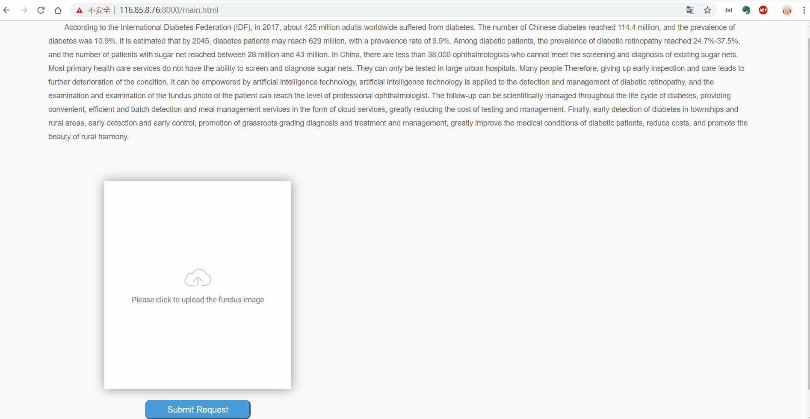

# dr_diagnose
A efficient and automated DR diagnosis system.  
Everyone can access the instance of the system deployed on the server.
Please visit this link: [http://116.85.8.76:8000/main.html](http://116.85.8.76:8000/main.html).  
We provide some case pictures, please visit this link: [http://116.85.8.76:8000/zqxt_tmp/dr.zip](http://116.85.8.76:8000/zqxt_tmp/dr.zip)

## Requirements 
This code requires you have TensorFlow 1.12, OpenCV 4.0.1,Django 2.0 or greater installed. To ensure you're up to date, run:   
    
    pip install tensorflow,opencv-python,django

## Dynamic representation of the diagnostic process

